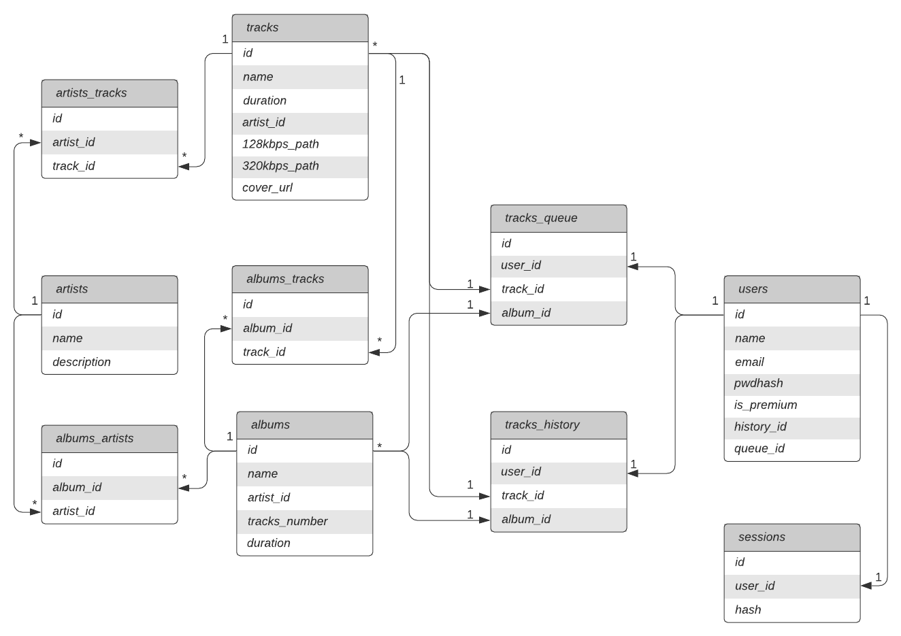
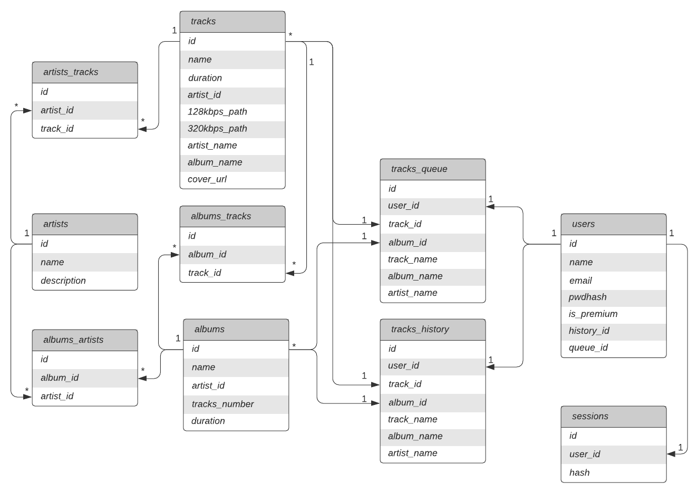
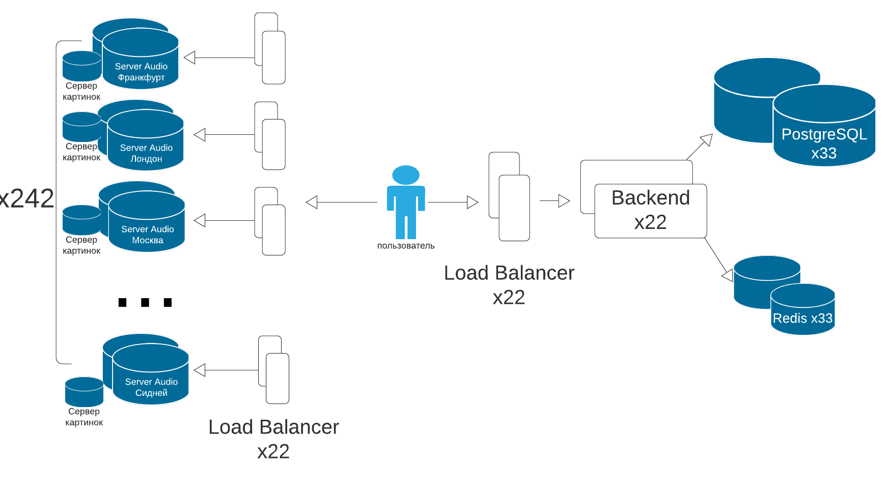

# highload-spotify

## Тема работы
Проектирование высоконагруженной системы - аналога Spotify.

## Основная функциональность
- Прослушивание музыки
- Получение информации о композициях, альбомах и исполнителях

## Целевая аудитория[1]
- Месячная аудитория: 365 млн. человек.
- Дневная аудитория: 44% от MAU = 160.6 млн. человек[2]
- Пользователей с платной подпиской: 165 млн. человек.
- Распределение аудитории по странам:

_Таблица 1_

Европа  | Северная Америка  | Латинская Америка  | Остальной мир  |
--------| ------------------| -------------------| ---------------|
121 млн.|       85 млн.     |       78 млн.      |     71 млн.    |

- Распределение аудитории по возрасту:

_Таблица 2_

18-24  | 25-34  | 35-44  | 45-54  |   55+   |
-------| -------| -------| -------| --------|
 26%   |  29%   |  16%   |  11%   |   19%   |
 
 
## Расчет нагрузки

### Объем хранилища

Рассчитаем размер одной песни.

Битрейт композиций для бесплатной и платной версий отличается - 128 Кбит/с и 320 Кбит/с соответственно.[3]

Длительность одной композиции составляет в среднем от 3 до 5 минут.[4] Для удобства рассчетов возьмем среднее значение в 4 минуты. Тогда средний размер одной песни:

```4 * 60 * 128 = 30720 Кбит = 3.75 Мб``` - в бесплатной версии

```4 * 60 * 320 = 75800 Кбит ~ 9.4 Мб``` - с подпиской

Если учесть долю пользователей с подпиской (```165/365 ~ 0.45```), то в среднем размер одной композиции:

```3.75 * 0.55 + 9.4 * 0.45 ~ 6.3 Мб ```

Количество композиций в Spotify - более 70 млн.[5] Каждую песню необходимо хранить в двух битрейтах, поэтому минимальный объем хранилища для всех композиций:

```70 * 10^6 * (3.75 + 9.4) ~ 878 Тб```

### Дневная нагрузка

DAU (указано выше): 160.6 млн. человек. В среднем пользователи Spotify тратят около 118 минут в день на прослушивание музыки.[6] Вес одной минуты средней композиции:

```6.3 / 4 ~ 1.6 Мб```

В таком случае дневной трафик равен:

```160.6 * 10^6 * 118 * 1.6 ~ 28917 Тб```

Трафик загрузки композиции:

```6.3 * 160.6 * 10^6 * (118 / 4) * 8 / 24 / 60 / 60 ~ 2699 Тбит/с```

Также необходимо учесть, что дневной трафик меняется в течение дня и в пиковые часы и выходные дни может быть до двух раз выше.[7]
Поэтому в дальнейших расчетах будем использовать значение в 5400 Тбит/с.

### RPS

За 118 минут пользователь Spotify может прослушать до 30 композиций. В процессе прослушивания отдельно взятой песни совершаются запрос за самим файлом, а также запрос за информацией о песне.

Рассмотрим типовой ежедневный пользовательский сценарий, состоящий из:

- Выбор плейлиста и его загрузка
  - Загрузка данных пользователя
  - Загрузка главной страницы со списком плейлистов
  - Загрузка конкретного плейлиста
- Смена плейлиста
  - Поиск нового плейлиста (возвращает список подходящих плейлистов)
  - Загрузка конкретного плейлиста
- Переключение на следующий трек

Чтобы численно посчитать RPS, примем, что действия 2 и 3 совершаются средним пользователем по 5 раз за сессию прослушивания в 118 минут.

Предполагаемая нагрузка:
```160.6 * 10^6 * (2 * 30 + 3 + 5 * 2 + 5) / 24 / 60 / 60 ~= 144986 RPS```

При этом, как отмечено выше, нагрузка может возрасти в 2 раза в пиковые часы.

Посчитаем RPS отдельно для каждой группы действий:

1. Загрузка списка плейлистов:

```160.6 * 10^6 * 5 / 24 / 60 / 60 ~= 9294 RPS```
2. Загрузка плейлиста:

```160.6 * 10^6 * 5 / 24 / 60 / 60 ~= 9294 RPS```
3. Загрузка трека.

Загрузка трека включает в себя запрос за треком и за информацией о нем. То есть необходимо сделать 30 * 2 запросов:

```160.6 * 10^6 * 2 * 30 / 24 / 60 / 60 ~= 111628 RPS```
4. Поиск

Поиск выполняется аналогично с загрузкой списка плейлистов:

```160.6 * 10^6 * 5 / 24 / 60 / 60 ~= 9294 RPS```

Сводка по RPS:

_Таблица 3_

Загрузка списка плейлистов  | Загрузка плейлиста | Загрузка трека  | Поиск
-------| -------| -------| -------|
9294 RPS   |  9294 RPS   |  111628 RPS   |  9294 RPS

## Логическая схема базы данных



## Физическая схема базы данных

Произведем денормализацию: в таблицы tracks, tracks_queue, tracks_history добавим дополнительные поля.



### Redis

Информацию о сессиях и очередях будем хранить в Redis. Redis хранит данные в памяти, что обеспечивает быстрое обращение к нужной информации. 

Для таблицы очередей для каждого пользователя будем хранить текущий альбом и текущую песню, тогда ежедневно необходимо:
``4(id) + 4(track_id) + 256(track_name) + 256(artist_name) + 256(album_name) + 4(user_id) + 4(album_id) = 784 байт``
``784 * 160.6 * 10^6 ~= 117 Гб``

Сессии пользователя: ``3 * 16 * 160.6 * 10^6 = 7 Гб``

В целом необходимо: ``117 Гб + 7 Гб = 124 Гб``.

### PostgreSQL

Основные данные сервиса будут храниться в PostgreSQL. Выполним оценку объема данных для хранения.

Пользователь:
``4(id) + 256(name) + 256(email) + 512(pwdhash) + 1(is_premium) + 4(history_id) + 4(queue_id) = 1037 байт``

Трек:
``4(id) + 256(name) + 4(duration) + 4(id_artist) + 2*256(path) + 256(artist_name) + 256(album_name) = 1292 байт``  
Всего 70 млн треков

Альбом: ``4(id) + 256(name) + 4(duration) + 4(tracks_number) + 4(artist_id) = 272 байт``  
Среднее количество песен в музыкальном
альбоме 12-14[8], возьмем среднее - 13, тогда у нас будет примерно 5.4 млн альбомов.

Исполнитель: ``4(id) + 256(name) + 1024(description) = 1284 байт``  
Пусть у каждого исполнителя будет по 5 альбомов, тогда у нас всего 1.1 млн исполнителей.

История прослушивания. Будем хранить треки, прослушанные пользователем за последние сутки.
``4(id) + 4(track_id) + 4(user_id) + 4(album_id) + 256(track_name) + 256(artist_name) + 256(album_name) + 4(date) = 788 байт``
``788 * 30 * 160.6 * 10^6 = 3.5 Тб``

Связь многие ко многим: ``3 * 4(id) = 12 байт``

Итого: ``(1037 * 160.6 (пользователи) + 1292 * 70 (треки) + 272 * 5.4 (альбомы) + 1284 * 1.1 (исполнители) + 788 * 30 * 160.6 (история) + 12 * (70 + 1.1 + 70)) * 10^6 =
285196600000 байт = 3.7 Тб``

Также для основной базы поставим две реплики, которые будут работать в роли Slave по отношению к основной базе (Master).

## Аудиофайлы

Для аудиофайлов понадобятся дополнительные сервера, распределенные по миру. Были выбраны следующие города:
- Франкфурт (Германия)
- Лондон (UK)
- Los Angeles (US)
- Washington D.C. (US)
- New York (US)
- Москва (Россия)
- Новосибирск (Россия)
- Дели (Индия)
- Бразилиа (Бразилия)
- Мехико (Мексика)
- Сидней (Австралия)

По ним будет распределяться нагрузка в 5400 Тбит/сек с учетом информации из Таблицы 1.
Кроме этого нам необходимо хранить 878 Тб медиатеки, для этого пусть на серверах будут SSD диски объемом 3,84 Тб
по 26 штук на каждый. Тогда один сервер может хранить 99,84 Тб, то есть для целой медиатеки нужно 9 серверов.
Если брать HDD диски, то можно рассчитывать на 16 Тб, если в каждом сервере будет по 26 таких дисков,
то достаточно 3 серверов. 
Для более рационального использования ресурсов, поставим во Франкфурт, Los Angeles и Москву сервера с SSD, а в остальные города с HDD.

_Таблица 4_

| Город       | Часть  | Нагрузка (Тбит/с) | Кол-во серверов
|-------------|--------|-------------------|--------------
|Франкфурт    |0.113   | 612               | 9
|Лондон       |0.113   | 612               | 9
|Москва       |0.113   | 612               | 9
|Los-Angeles  |0.08    | 432               | 9
|Washington   |0.08    | 432               | 3
|New York     |0.08    | 432               | 3
|Владивосток  |0.067   | 360               | 3
|Бразилиа     |0.11    | 594               | 9
|Мехико       |0.11    | 594               | 3
|Дели         |0.067   | 360               | 9
|Сидней       |0.067   | 360               | 9

Запросы на эти кластеры будут приходить через DNS, но каждому понадобится свой балансировщик
для распределения запросов между серверами. Каждому балансировщику дадим по одной реплике для обеспечения отказоустойчивости.

## Выбор технологий

Для написания бэкенда используем язык Golang как язык, который хорошо зарекомендовал себя в разработке высоконагруженных приложений и на который несложно найти специалистов. 
В случае использования микросервисной архитектуры (например, микросервисы авторизации и прослушивания альбома), можно использовать систему gRPC.
Для написания фронтенда используем TypeScript, для создания SPA-приложения и более быстрой работы с DOM будет использована библиотека React.
В качестве балансировщика и реверс-прокси будет использован Nginx.

## Схема проекта

Подведем итог всех расчетов и отобразим результат в виде схемы:


          
| Сервер    | CPU  | RAM | Диск                          | Кол-во   | Местоположение
|-----------|------|-----|-------                        |-------   |---
|Бэкенд     |32    | 256 | 32Гб х 1SSD                   | (1+1)*11 |Города из _Таблицы 4_
|PostgreSQL |32    | 512 | 256Гб х 1SSD                  | (1+2)*11 |Города из _Таблицы 4_
|Redis      |16    | 128 | 32Гб х 1SSD                   | (1+2)*11 |Города из _Таблицы 4_
|Аудио      |32    | 256 | 3.84Тб х 26SSD + 16Тб х 26HDD | (1+1)*75 |Города из _Таблицы 4_
|Nginx      |32    | 256 | 64Гб х 1SSD                   | (1+1)*11 (аудио) + (1+1)*11 (проксирование к бэкенду)|Города из _Таблицы 4_

## Список источников

[1] https://www.businessofapps.com/data/spotify-statistics/

[2] https://www.goodwatercap.com/thesis/understanding-spotify

[3] https://support.spotify.com/us/article/audio-quality/

[4] https://www.vox.com/2014/8/18/6003271/why-are-songs-3-minutes-long

[5] https://newsroom.spotify.com/company-info/

[6] https://www.gwi.com/reports/music-streaming-around-the-world

[7] https://habr.com/ru/company/dcmiran/blog/496542/

[8] https://ru.wikipedia.org/wiki/%D0%9C%D1%83%D0%B7%D1%8B%D0%BA%D0%B0%D0%BB%D1%8C%D0%BD%D1%8B%D0%B9_%D0%B0%D0%BB%D1%8C%D0%B1%D0%BE%D0%BC
